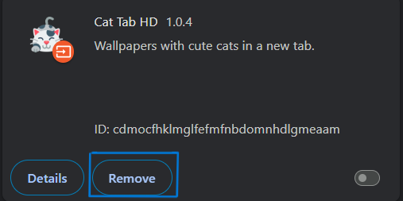

# 🚀 Cybersecurity
**Project Title:** Identifying and Removing Suspicious Browser Extensions  

This task demonstrates how to analyze installed browser extensions, identify potential security risks, and remove unsafe or unnecessary ones. The project highlights the importance of **browser hygiene** as part of cybersecurity practices.  

---

## 🎯 Objective
To improve security awareness by learning how malicious or untrusted extensions can affect browser performance, privacy, and safety.

---

## 🛠 Steps Performed
1. **Open Extension Manager**  
   - Chrome → `chrome://extensions/`  
   - Firefox → `about:addons`  

2. **Review Installed Extensions**  
   - Verified extension names, developers, permissions, and reviews.  

3. **Identify Risks**  
   - Flagged suspicious permissions (e.g., “Read and change data on all websites”).  
   - Found unused extensions slowing performance.  

4. **Remove Suspicious/Unnecessary Extensions**  
   - Disabled and permanently removed them.  

5. **Restart Browser**  
   - Verified performance improved and reduced background processes.  

6. **Research Risks**  
   - Malicious extensions can:  
     - Steal cookies or passwords  
     - Track browsing activity  
     - Inject ads or malware  

7. **Documentation**  
   - Screenshots were captured *before* and *after* extension removal.  

8. **Outcome**  
   ✔ Improved awareness of browser extension risks  
   ✔ Safer and faster browsing experience  
   ✔ Documented process for learning and teaching purposes  

---

## 📸 Screenshots
### 🔹 Chrome Extension
.

### 🔹 Before Removing Suspicious Extensions

### 🔹 After Removing Suspicious Extensions

---

## 📊 Learnings
- Always review extension permissions carefully.  
- Only install from **trusted developers** with good reviews.  
- Regularly audit and remove unused add-ons.  

---

## 📂 Repository Structure

Task7-Browser-Extension-Security/
├── README.md                 # Project documentation
├── code.txt                  # Step-by-step task completion
├── report.txt                # Summary of findings & outcomes
├── screenshots/              # Folder for screenshots
│   ├── s.png                 # Chrome Extensions
│   ├── s1.png                # Extensions before cleanup
│   ├── s2.png                # Extensions after cleanup

